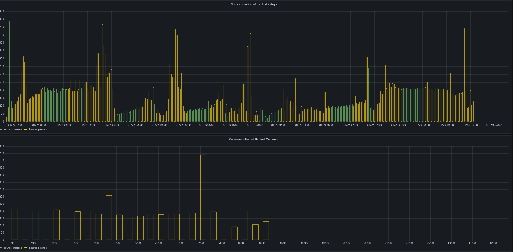
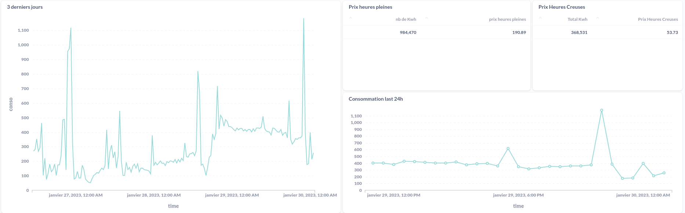
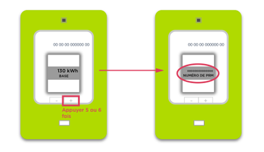

# Monitor your bills with your linky !

In this repository, we will learn how to create an interface to see our electric consumption. The tools used here are :
- Python3
- PostgreSQL with the extension timescaleDB 
- Grafana
- Telegram 
- Metabase

With grafana, at the end, you will see something like this :

And with Metabase it will be like this : 

Ok now, let's see how we create this result ! 

## Requirements

### Access to the Enedis APP

First of all, you need to get create an account on Enedis. To monitor your data, you need to acess the Enedis API. So to this, you have to create an account on Enedis and then access to get an application called `my electrical data`. 

After create your account on Enedis APP, get the number of your linky (this number is called the PDL number). You have to click on the button present on the electric meter. And you can check, there are lots on information on this meter ! Here is what it will look like : 

